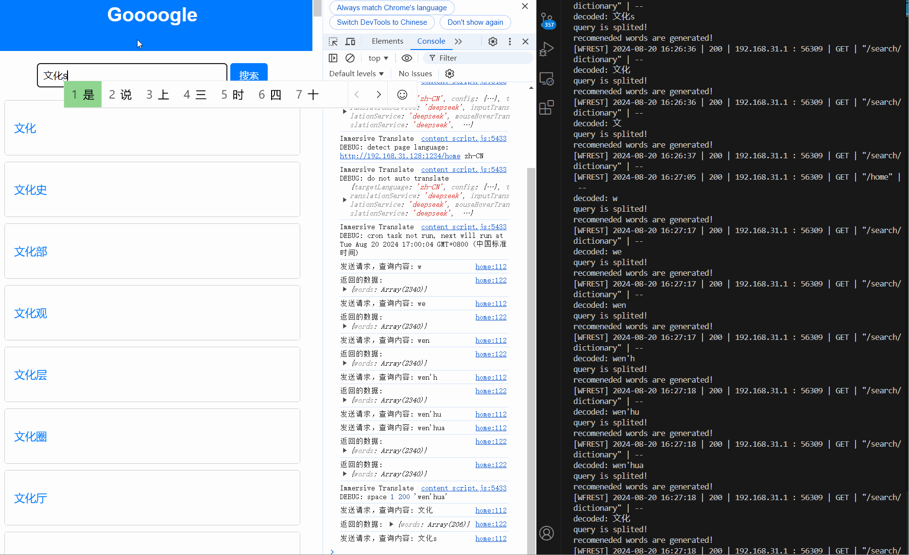
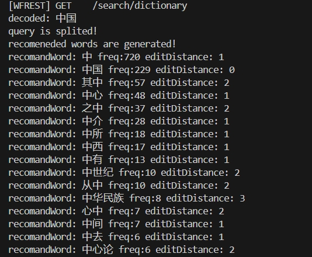

C++ 网络编程 线程

## Roadmap

### Model1 Preparation

离线阶段准备的是在服务端启动之前就做好的事情，与用户发送请求之后再做大的事情不是同一个程序

- [x] 1. 语料整理

  - [x] 英文语料整理（梳理语料文件结构）
  - [x] 中文语料整理（梳理预料文件结构）

- [x] 2. 英文语料清洗（切割，空格）

  - [x] 读取所有语料的路径 

    src/makedict: inputFiles

  - [x] 存放raw数据

    src/DictProducer: setRaw

  - [x] 数据清洗（大写转小写，符号使用空格代替）

    src/DictProducer: cleanEnMaterial

  - [x] 词频统计

    src/DictProducer: buildEnDict

- [x] 3. 英文推荐词典生成（词频统计），将map 生成一个文件

  src/DictProducer: store

- [x] 4. 中文语料清洗（去除空格和标点符号）

  cleanCnMaterial

- [x] 5. 中文语料词典生成（分割+词典生成），自动合并进入dict.dat

- [x] 6. 生成并且存储索引文件

  - [x] 读取`vector<pair<string, int>>` 中的每一个单词的所有字符
  - [x] 存储到dictIndex.dat

### Model1 Online Part

- [x] 搭建服务器框架(WFREST[√]  or REACTOR )
- [x] 预热，将词典和词典索引加载到内存当中，读文件
- [x] 关键词分解，候选词召回
- [x] 返回响应



### Model2 Preparation

- [ ] 数据清洗，生成网页库
- [ ] 网页去重，生成新网页库
- [ ] 网页偏移库
- [ ] 倒排索引库

### Model2 Online Part

- [ ] 预热，将数据加载到内存中
- [ ] 关键词全文搜索
- [ ] 相似度排序

## File structure

- `src/`：存放系统的源文件
- `include/`：存放系统的头文件
- `bin/`：存放系统的可执行程序
- `conf/myconf.conf`： 存放系统程序中所需的相关配置
- `data/dict.dat`：存放词典
- `data/dictindex.dat`：存放单词所在位置的索引库
- `data/newripepage.dat`：存放网页库
- `data/newoffset.dat`：存放网页的偏移库
- `data/invertIndex.dat`：存放倒排索引库
- `log/`：存放日志文件

## Problem

1. Makefile伪目标，可以一次性生成多个可执行文件

   ```makefile
   # 伪目标：生成所有可执行文件
   all: bin/Makedict bin/main
   
   # 目标：生成 bin/Makedict
   bin/Makedict: bin/Makedict.o bin/DictProducer.o bin/SplitTool.o
           g++ bin/Makedict.o bin/DictProducer.o bin/SplitTool.o -o bin/Makedict -g
   
   # 目标：生成 bin/Makedict.o
   bin/Makedict.o: src/Makedict.cc
           g++ -c src/Makedict.cc -o bin/Makedict.o -I include
   
   # 目标：生成 bin/DictProducer.o
   bin/DictProducer.o: src/DictProducer.cc
           g++ -c src/DictProducer.cc -o bin/DictProducer.o -I include
   
   # 目标：生成 bin/SplitTool.o
   bin/SplitTool.o: src/SplitTool.cc
           g++ -c src/SplitTool.cc -o bin/SplitTool.o -I include
   
   # 目标: 生成 bin/main
   bin/main: bin/main.o bin/SearchEngineServer.o bin/KeyRecomander.o
           g++ bin/main.o bin/SearchEngineServer.o bin/KeyRecomander.o -o bin/main -lwfrest -lworkflow -g
   
   # 目标：生成 bin/main.o
   bin/main.o: src/main.cc
           g++ -c src/main.cc -o bin/main.o -I include
   
   # 目标：生成 bin/SearchEngineServer.o
   bin/SearchEngineServer.o: src/SearchEngineServer.cc
           g++ -c src/SearchEngineServer.cc -o bin/SearchEngineServer.o -I include
   
   # 目标：生成 bin/KeyRecomander.o
   bin/KeyRecomander.o: src/KeyRecomander.cc
           g++ -c src/KeyRecomander.cc -o bin/KeyRecomander.o -I include
   
   # 清理命令
   clean:
           rm -f bin/*
   ```

2. 单例模式冲突，即使创建了两个对象，使用的成员函数仍然是最先所创建的对象的

3. Http 请求中的中文是编码过的，需要解码后再处理

   ```c++
   string urlDecode(const std::string &encoded) {
       std::ostringstream decoded;
       decoded.fill('0');
       std::string::size_type len = encoded.length();
       for (std::string::size_type i = 0; i < len; ++i) {
           if (encoded[i] == '%') {
               if (i + 2 < len) {
                   std::string hex = encoded.substr(i + 1, 2);
                   int value = 0;
                   std::istringstream(hex) >> std::hex >> value;
                   decoded << static_cast<char>(value);
                   i += 2;
               }
           } else if (encoded[i] == '+') {
               decoded << ' ';
           } else {
               decoded << encoded[i];
           }
       }
       return decoded.str();
   }
   ```

4. 排序算法：候选词有`频率`和`最小编辑距离`两个主要的维度，需要选择合适的算法对候选词进行排序

   

   按照最小编辑距离升序，若最小编辑距离相同，子按照热度的降序排列

   ```c++
   vector<CandidateResult> KeyRecomander::sortCandidates(vector<CandidateResult> candidates) {
       // 使用自定义比较函数进行排序
       sort(candidates.begin(), candidates.end(), [](const CandidateResult& a, const CandidateResult& b) {
           // 按编辑距离升序排序
           if (a._dist != b._dist) {
               return a._dist < b._dist; // 低编辑距离排在前面
           }
           // 若编辑距离相同，则按频率降序排序
           return a._freq > b._freq; // 高频率排在前面
       });
       return candidates;
   }
   ```

5. workflow 动态库问题

   可以将`usr/local/lib64` 中的 .`so` 文件移动到 `/lib64` 当中
