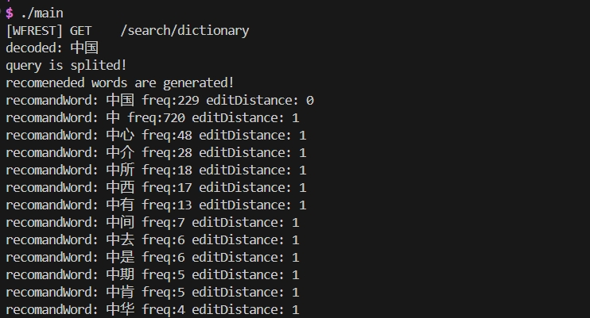

[](https://github.com/redis/redis) [](https://github.com/pallets/flask) [](https://github.com/leethomason/tinyxml2.git) [](https://github.com/yanyiwu/simhash) [](https://github.com/yanyiwu/cppjieba) [](https://www.openai.com)

**Findoria** 是一个智能搜索引擎项目，利用自然语言处理技术和高效算法，为用户提供精准的搜索结果和个性化推荐。项目整合了 CPPjieba 分词、tinyxml 数据处理、Simhash 相似度计算，并通过调用 DeepSeek(chat) 的 API 实现了基于 Python Flask 的大语言模型 AI 回答系统。同时，Findoria 采用了高性能的 Workflow (wfrest) 框架，实现了实时推荐词和推荐网页的功能，致力于构建一个高效、智能的搜索平台。

##### Model1 Preparation

离线阶段准备的是在服务端启动之前就做好的事情，与用户发送请求之后再做大的事情不是同一个程序

- [x] 1. 语料整理

  - [x] 英文语料整理（梳理语料文件结构）
  - [x] 中文语料整理（梳理预料文件结构）

- [x] 2. 英文语料清洗（切割，空格）

  - [x] 读取所有语料的路径 

    src/makedict: inputFiles

  - [x] 存放raw数据

    src/DictProducer: setRaw

  - [x] 数据清洗（大写转小写，符号使用空格代替）

    src/DictProducer: cleanEnMaterial

  - [x] 词频统计

    src/DictProducer: buildEnDict

- [x] 3. 英文推荐词典生成（词频统计），将map 生成一个文件

  src/DictProducer: store

- [x] 4. 中文语料清洗（去除空格和标点符号）

  cleanCnMaterial

- [x] 5. 中文语料词典生成（分割+词典生成），自动合并进入dict.dat

- [x] 6. 生成并且存储索引文件

  - [x] 读取`vector<pair<string, int>>` 中的每一个单词的所有字符
  - [x] 存储到dictIndex.dat

##### Model1 Online Part

- [x] 搭建服务器框架(WFREST[√]  or REACTOR )
- [x] 预热，将词典和词典索引加载到内存当中，读文件
- [x] 关键词分解，候选词召回
- [x] 返回响应

##### Model2 Preparation

- [x] 数据清洗，生成网页库（依赖`tinyxml`）

- [x] 网页去重，生成新网页库  

  使用Google的simhash算法，将网页提取出指纹，如果指纹越接近说明越有可能完全重复

  思路：

  1. 对n个网页进行两两对比指纹，双重for循环，n方的复杂度
  2. `vector<simhash>`, 后续加入的webpage与所有的simhash距离都不大才可以加入

- [x] 网页偏移库

  清洗的时候，记录一下每一个webpage在文件中的起始位置和长度，相比于整个pagelib是非常小的，可以加载到内存里，再通过这个偏移库访问pagelib

  ```c++
                          pos  length
                           |    |
  unordered_map<int, pair<int, int>> _offset;
                 |
               docid
  ```

- [x] 倒排索引库

  ```c++
                               docid   weight
                                 |      |
  unordered_map<string,set<pair<int, double>> _invertIndex;
                   |
                  单词
  ```

##### Model2 Online Part

- [x] 预热，将数据加载到内存中

  - [x] 读取 offset
  - [x] 读取 invertIndex

- [x] 关键词全文搜索（召回），找交集

- [x] 相似度排序，对比余弦相似度

  用priority_queue排序

- [x] 把前十个内容取出来，取出WebPage，放入json,返回给客户端


## Optimize

- [ ] 推荐词优化
- [ ] Redis 优化
- [ ] WSL 数据结构调整
- [ ] Workflow 资源池

## File structure

- `src/`：存放系统的源文件
- `include/`：存放系统的头文件
- `bin/`：存放系统的可执行程序
- `conf/myconf.conf`： 存放系统程序中所需的相关配置
- `data/dict.dat`：存放词典
- `data/dictindex.dat`：存放单词所在位置的索引库
- `data/newripepage.dat`：存放网页库
- `data/newoffset.dat`：存放网页的偏移库
- `data/invertIndex.dat`：存放倒排索引库
- `log/`：存放日志文件

## Problems

1. Makefile伪目标，可以一次性生成多个可执行文件

2. 单例模式冲突，即使创建了两个对象，使用的成员函数仍然是最先所创建的对象的

3. Http 请求中的中文是编码过的，需要解码后再处理

   ```c++
   string urlDecode(const std::string &encoded) {
       std::ostringstream decoded;
       decoded.fill('0');
       std::string::size_type len = encoded.length();
       for (std::string::size_type i = 0; i < len; ++i) {
           if (encoded[i] == '%') {
               if (i + 2 < len) {
                   std::string hex = encoded.substr(i + 1, 2);
                   int value = 0;
                   std::istringstream(hex) >> std::hex >> value;
                   decoded << static_cast<char>(value);
                   i += 2;
               }
           } else if (encoded[i] == '+') {
               decoded << ' ';
           } else {
               decoded << encoded[i];
           }
       }
       return decoded.str();
   }
   ```

4. 排序算法：候选词有`频率`和`最小编辑距离`两个主要的维度，需要选择合适的算法对候选词进行排序

   

   一种可以选择的排序思路是按照最小编辑距离升序，若最小编辑距离相同，则按照热度的降序排列

   ```c++
   vector<CandidateResult> KeyRecomander::sortCandidates(vector<CandidateResult> candidates) {
       // 使用自定义比较函数进行排序
       sort(candidates.begin(), candidates.end(), [](const CandidateResult& a, const CandidateResult& b) {
           // 按编辑距离升序排序
           if (a._dist != b._dist) {
               return a._dist < b._dist; // 低编辑距离排在前面
           }
           // 若编辑距离相同，则按频率降序排序
           return a._freq > b._freq; // 高频率排在前面
       });
       return candidates;
   }
   ```

5. workflow 动态库问题

   可以将`usr/local/lib64` 中的 .`so` 文件移动到 `/lib64` 当中

6. 对 Pagelib 去重的遍历

   先添加根节点，再用 tinyxml2 遍历

   ```xml
   <doc>
   	<docid>1</docid>
   	<title>...</title>
   	<link>...</link>
   	<description>...</description>
   	<content>...</content>
   </doc>
   ```

7. 网页清洗遇到的问题：标签中的文本有特殊字符，可以用vscode 的 xml 拓展检测错标红的地方，再清洗干净

8. 网页去重遇到的问题：内存会爆

   一种可行的解决方案是每处理100个节点做一次清理

   ```c++
       while (docElement)
       {
   		// 盘等和处理操作
           // 获取下一个 doc 元素
           docElement = docElement->NextSiblingElement("doc");
           // 每处理100个节点，清理内存并暂停
           if (i % 100 == 0)
           {
               cout << "Processed " << i << " documents. Cleaning memory and pausing...\n";
               rawDoc.Clear(); // 清理 XMLDocument 对象
               rawDoc.LoadFile(src.c_str()); // 重新加载文件
               root = rawDoc.RootElement(); // 重新获取根元素
               if (!root)
               {
                   cout << "Error reloading XML file after cleanup.\n";
                   return;
               }
               docElement = root->FirstChildElement("doc"); // 重新定位到当前处理的位置
               for (int j = 0; j < i; ++j)
               {
                   docElement = docElement->NextSiblingElement("doc");
               }
               // 暂停一小段时间，让系统有机会进行其他操作
               sleep(2);
           }
       }
   ```

9. 倒排索引的计算

   - `TF`: Term Frequency, 某个词汇在所在文章出现的次数

   - `DF`: Document Frenquency, 某个词汇和包含它的文章数量

   - `IDF`: 逆文档频率，表示该词对于该篇文章的重要性

     ```math
     IDF = log_{2}(\frac{N}{DF+1})
     ```

   - `w`: 全局权重

     ```math
     w=TF\times IDF
     ```

   - `weight`: 文章各个词汇频率归一化的结果，是存在倒排索引中的

   ```c++
   unordered_map<string, int> PagelibProcessor::calculateTermFrequency(const vector<string> &tokens)
   {
       unordered_map<string, int> termFreq;
       for (const auto &token : tokens)
       {
           termFreq[token]++;
       }
       return termFreq;
   }
   
   unordered_map<string, int> globalDF; // 词汇和包含它的文章数量
   int totalDocuments = 0;
   
   // 词频计算的结构
   struct WordStats
   {
       int tf;        // 词频
       double weight; // 权重
   };
   
   SplitTool *cnCuttor = new SplitToolCppJieba(); // 用jieba分词
   
   void PagelibProcessor::buildInvertIndexMap()
   {
       cout << "Generating InvertIndex...\n";
       SplitTool *cnCuttor = new SplitToolCppJieba(); // 用jieba的库
   
       // 用于存储每个文档的词频和权重
       vector<unordered_map<string, WordStats>> documentWordStats;
   
       // 遍历所有文档
       for (int i = 1; i < _offset.size() + 1; i++)
       {
           auto it = _offset.find(i);
           cout << "Processing page: " << it->first << "...\n";
           int docid = it->first;
           int start = it->second.first;
           int length = it->second.second;
   
           string content = getDocContent("../data/Pagelib.dat", docid, _offset);
           content = cleanMaterial(content);
           if (content.empty())
               continue;
   
           vector<string> tokens = cnCuttor->cut(content);
           unordered_map<string, WordStats> localTF; // 记录当前文档的词频
   
           // 统计当前文档中每个单词的词频
           for (const auto &token : tokens)
           {
               if (!token.empty())
               {
                   localTF[token].tf++;
               }
           }
           cout << "Word frequency count is done!\n";
   
           // 将每个文档的词频信息存储到数组中
           documentWordStats.push_back(localTF);
           totalDocuments++;
       }
       cout << "All pages is processed!\n";
   
       // 更新全局文档频率 (DF)
       for (const auto &localTF : documentWordStats)
       {
           for (const auto &entry : localTF)
           {
               const string &word = entry.first;
   
               // 更新当前单词的文档频率
               if (globalDF.find(word) == globalDF.end())
               {
                   globalDF[word] = 1; // 第一次见到该单词
               }
               else
               {
                   globalDF[word]++; // 增加包含该词汇的文档数量
               }
           }
       }
   
       // 计算权重并更新倒排索引
       for (size_t i = 0; i < documentWordStats.size(); ++i)
       {
           const auto &localTF = documentWordStats[i];
           int docid = i+1; // 假设文档ID就是索引位置
   
           // 计算当前文档的权重总和
           double totalWeight = 0.0;
           unordered_map<string, double> weights;
   
           for (const auto &entry : localTF)
           {
               const string &word = entry.first;
               int tf = entry.second.tf;
   
               // 确保tf不为零
               if (tf > 0)
               {
                   // 计算当前文档中的权重
                   double idf = log2(static_cast<double>(totalDocuments) / (globalDF[word] + 1)); // 使用新的IDF公式
   
                   // 确保idf为正值
                   if (idf > 0)
                   {
                       double weight = tf * idf; // 计算权重
                       weights[word] = weight;   // 存储每个单词的权重
                       totalWeight += weight;    // 更新总权重
                   }
               }
           }
   
           // 归一化权重并更新倒排索引
           if (totalWeight > 0) // 确保总权重大于零以进行归一化
           {
               for (const auto &entry : weights)
               {
                   const string &word = entry.first;
                   double weight = entry.second / totalWeight; // 归一化
                   _invertIndex[word].insert({docid, weight}); // 更新倒排索引
               }
           }
       }
       cout << "InvertIndex is generated!\n";
       printInvertIndex(_invertIndex); // 调用输出倒排索引的函数
   }
   
   ```

10. 框架整体结构变化之后一定要make clean;

11. 防抖技术(debounce)

    ```javascript
    function debounce(func, wait) {
        let timeout;
        return function (...args) {
           clearTimeout(timeout);
            timeout = setTimeout(() => func.apply(this, args), wait);
        };
    }
    ```

12. 查看网络端口的监听状态

    
